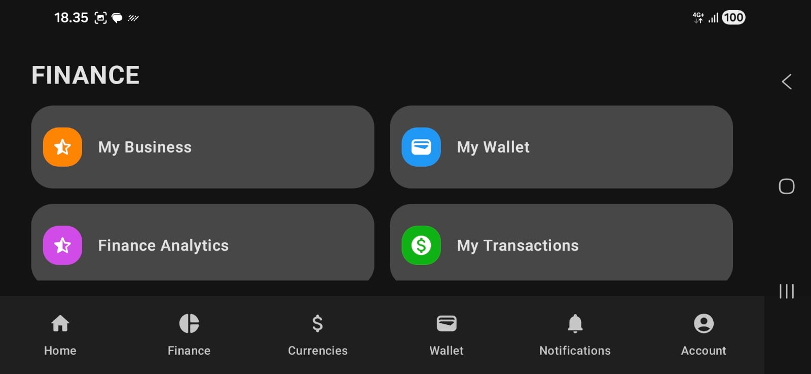

# Valuta - E-Wallet Android App

Valuta adalah aplikasi e-wallet untuk memudahkan transaksi, cek saldo, notifikasi, dan pengelolaan akun. Aplikasi ini mendukung tampilan **portrait** dan **landscape**.

---

## 📱 Tampilan Portrait

### Beranda

### Dompet

### Notifikasi

### Akun

---

## 🖥 Tampilan Landscape

### Beranda

### Keuangan

### Kurs Mata Uang

### Dompet

### Notifikasi

### Akun

---

## 🚀 Fitur Utama

- Cek saldo dan riwayat transaksi
- Notifikasi real-time
- Pengelolaan akun pengguna
- Tampilan responsif (portrait & landscape)

---

## 🛠 Teknologi

- Android (Kotlin/Java)
- Material Design
- Firebase (opsional untuk backend)

---

