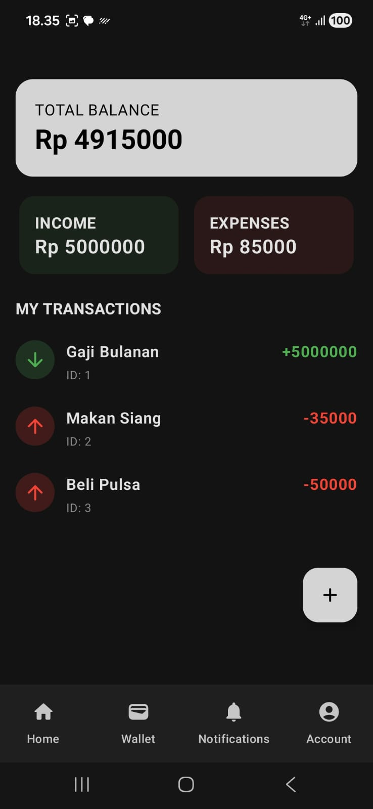
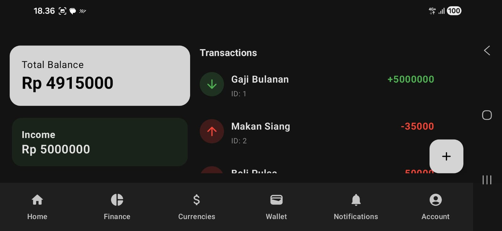
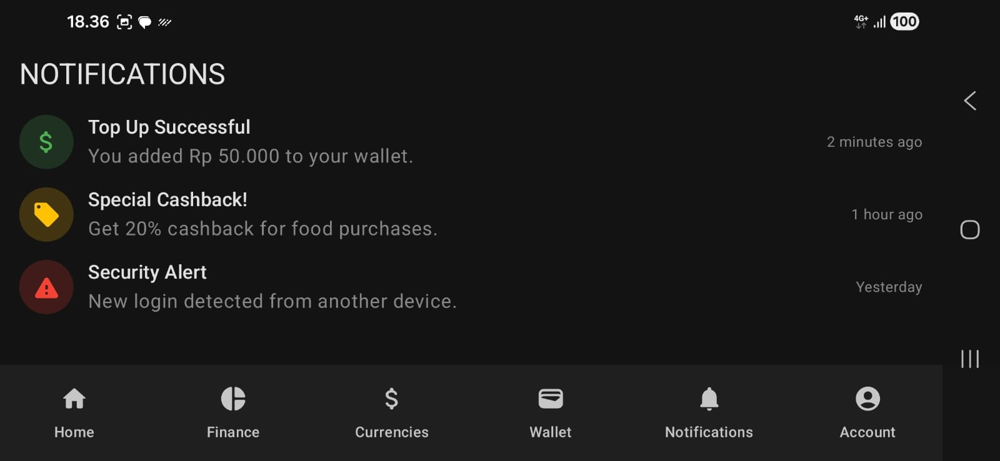

# Valuta - E-Wallet Android App

Valuta adalah aplikasi e-wallet untuk memudahkan transaksi, cek saldo, notifikasi, dan pengelolaan akun. Aplikasi mendukung tampilan **portrait** dan **landscape** agar nyaman digunakan di berbagai orientasi layar.

---

## 📱 Tampilan Portrait

### Beranda

### Dompet

### Notifikasi

### Akun

---

## 🖥 Tampilan Landscape

### Beranda

### Keuangan

### Kurs Mata Uang

### Dompet

### Notifikasi

### Akun

---

## 🚀 Fitur Utama

- **Cek Saldo & Riwayat Transaksi** – Mudah melihat saldo dan riwayat pembayaran.
- **Dompet Digital** – Mengelola saldo, top-up, dan transfer.
- **Notifikasi Real-Time** – Dapatkan pemberitahuan transaksi secara langsung.
- **Akun Pengguna** – Profil lengkap dengan pengaturan keamanan.
- **Tampilan Responsif** – Mendukung mode portrait dan landscape.

---

## 🛠 Teknologi

- Android (Kotlin / Java)  
- Material Design  
- Firebase (opsional, untuk backend)  

---

